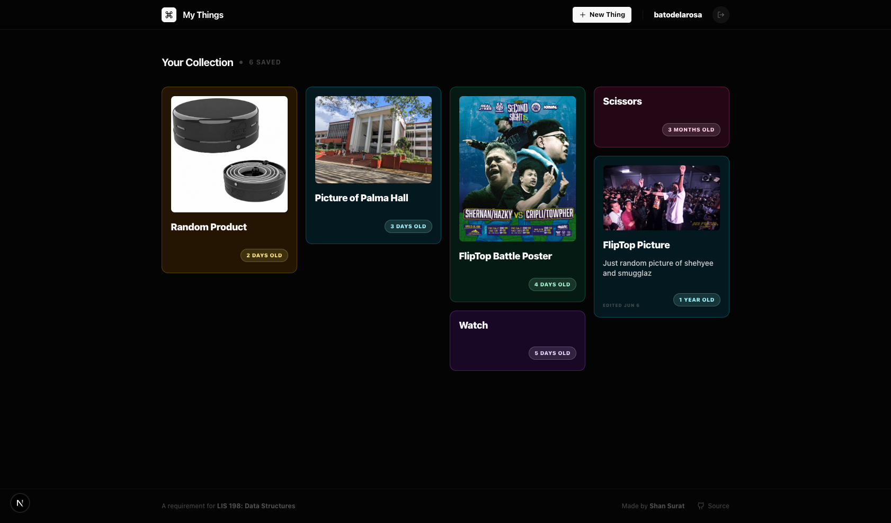
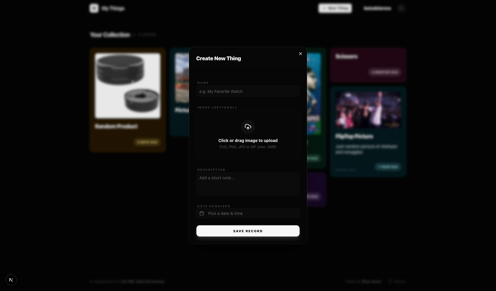
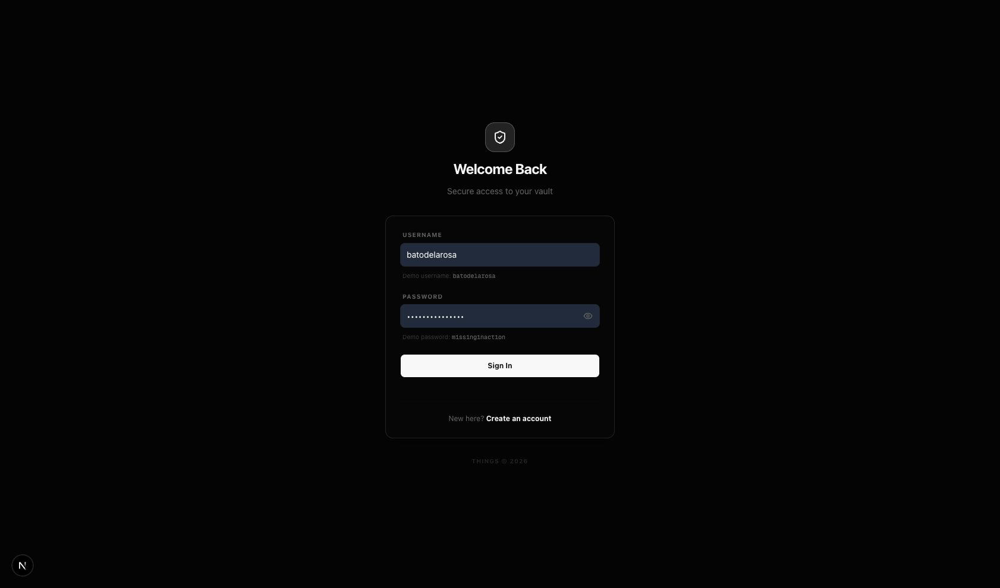

# My Things

**[Live Demo (mythings.shansurat.dev)](https://mythings.shansurat.dev)** | **[GitHub Repository](https://github.com/shansurat/my-things)**



A simple, beautiful digital dashboard for tracking your personal collection of items. Built as a requirement for LIS 198: Data Structures for LIS at UP Diliman.

## Screenshots
<p align="center">
  
  &nbsp;
  
</p>

## Features
- **Item Tracking**: Add items with their names, descriptions, and acquisition dates.
- **Image Uploads**: Drag and drop images to associate them with your items.
- **Real-time Age**: Watch your items age in real-time right on the dashboard.
- **Masonry Layout**: A dynamic, beautiful grid layout that adapts to your screen and image sizes.
- **Lightbox**: Click on any image to view it in full screen.
- **Authentication**: Secure login system.

## Tech Stack
- **Frontend**: Next.js 15, React, Tailwind CSS
- **Backend**: Next.js API Routes
- **Database**: MongoDB (Mongoose)
- **Authentication**: NextAuth.js

*Note on Images: For this project, images are stored directly in MongoDB as binary buffers. While not recommended for large-scale production apps, it perfectly suits the scope and requirements of this assignment.*

## Getting Started

### Prerequisites
Make sure you have Node.js installed.

### MongoDB Database Setup

You can use either a cloud database or a local installation.

**Option A: Cloud Database (MongoDB Atlas)**
1. Create a free account at [MongoDB Atlas](https://www.mongodb.com/cloud/atlas/register).
2. Create a new database cluster (the free Shared tier is perfect).
3. In the security menu under **Database Access**, create a new database user with a username and strong password.
4. Under **Network Access**, add your current IP address (or allow all IPs `0.0.0.0/0` for ease of development).
5. Go to your Databases, click **Connect** on your cluster, choose **Connect your application**, and copy the connection string.
6. Keep this string handy. You'll need to replace `<password>` with the password you just created.

**Option B: Local Database**
1. Download and install [MongoDB Community Server](https://www.mongodb.com/try/download/community).
2. Start the MongoDB service on your machine.
3. Your connection string will typically be: `mongodb://127.0.0.1:27017/my-things`

### Setup
1. Clone the repository
2. Install dependencies:
   ```bash
   npm install
   ```
3. Create a `.env.local` file in the root directory with the following variables:
   ```env
   MONGODB_URI=your_mongodb_connection_string
   AUTH_SECRET=your_nextauth_secret
   ```
4. Run the development server:
   ```bash
   npm run dev
   ```

### Production
For Vercel deployment, ensure you add `AUTH_TRUST_HOST=true` to your environment variables.
